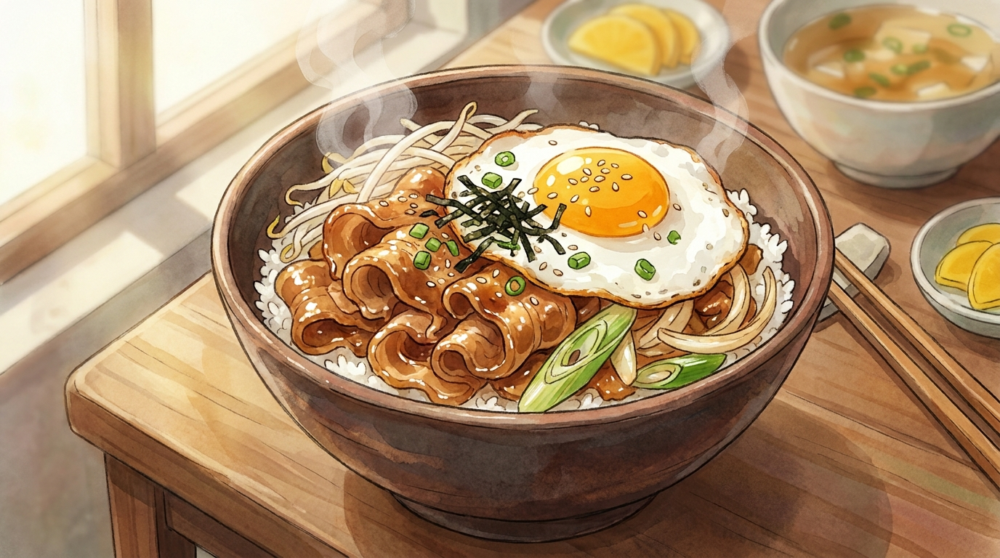

# 15분 간장버터 대패덮밥

냉동실 대패삼겹살과 밥 한 공기면 되는 자취 최강 메뉴. 숙주가 기름기를 잡아 줍니다.

- **분량**: 2인분
- **조리 시간**: 15분
- **난이도**: 아주 쉬움

## 재료

### 메인
- 대패삼겹살 300g (냉동 그대로 OK)
- 숙주 200g (한 봉지)
- 양파 1/2개 (채 썰기)
- 대파 1대 (어슷 썰기)
- 밥 2공기 (따뜻하게)

### 양념
- 진간장 3큰술
- 맛술 2큰술
- 설탕 1큰술
- 굴소스 1작은술
- 다진 마늘 1큰술
- 후추 약간
- 버터 2큰술

### 고명
- 달걀 2개 (반숙 프라이)
- 쪽파 또는 대파 흰 부분 (송송 썰기)
- 통깨, 김가루

## 만드는 법

1. **양념장 섞기 (0분)** — 작은 볼에 간장, 맛술, 설탕, 굴소스, 다진 마늘, 후추를 넣고 설탕이 녹을 때까지 젓습니다. 미리 섞어 두면 볶는 동안 허둥대지 않습니다.

2. **달걀 프라이 (2분)** — 팬에 기름을 두르고 달걀 2개를 반숙으로 부쳐 접시에 빼 둡니다. 같은 팬을 이어서 씁니다.

3. **고기 굽기 (5분)** — 팬을 센 불로 달구고 대패삼겹살을 펼쳐 넣습니다. **뒤적이지 말고 1분간 그대로** 두어 바닥면에 갈색이 붙게 합니다. 그다음부터 뒤적여 3분간 굽습니다.

4. **기름 빼기 (8분)** — 팬이 기름으로 흥건하면 키친타월로 절반쯤 닦아 냅니다. 이걸 안 하면 덮밥이 느끼해집니다.

5. **채소 넣기 (9분)** — 양파와 대파를 넣고 센 불에서 1분간 볶습니다. 양파는 아삭함이 남을 정도로만.

6. **양념 + 숙주 (11분)** — 양념장을 팬 가장자리에 둘러 붓고 30초간 끓입니다. 숙주를 올리고 **1분만** 크게 뒤적입니다. 숙주는 오래 볶으면 물이 나와 축 처집니다.

7. **버터 마무리 (13분)** — 불을 끄고 버터 2큰술을 넣어 잔열로 녹이며 버무립니다. 불이 켜져 있으면 버터가 타서 향이 죽습니다.

8. **담기 (15분)** — 그릇에 밥을 담고 고기와 숙주를 소스째 올린 뒤 달걀 프라이를 얹습니다. 쪽파, 통깨, 김가루를 뿌립니다.

## 성공 포인트

| 포인트 | 이유 |
|---|---|
| 첫 1분은 건드리지 않기 | 마이야르 반응이 일어날 시간입니다. 계속 뒤적이면 고기가 삶아집니다. |
| 기름 절반 제거 | 대패삼겹살은 기름이 많습니다. 남기면 소스가 겉돌아요. |
| 숙주는 1분 | 아삭함이 이 메뉴의 핵심 식감입니다. |
| 버터는 불 끄고 | 태우지 않아야 고소한 유지방 향이 살아납니다. |

## 응용

- **매콤하게**: 양념장에 고추장 1큰술 + 고춧가루 1작은술
- **일본식**: 굴소스 빼고 미림을 늘린 뒤 시치미 뿌리기
- **채소 추가**: 팽이버섯, 부추, 양배추 채 무엇이든
- **고기 대신**: 닭다리살, 새우, 두부 스테이크

## 곁들이면 좋은 것

시원한 미역국이나 달걀국. 그리고 단무지나 오이피클처럼 새콤한 절임 한 접시가 기름진 맛을 계속 리셋해 줍니다.
