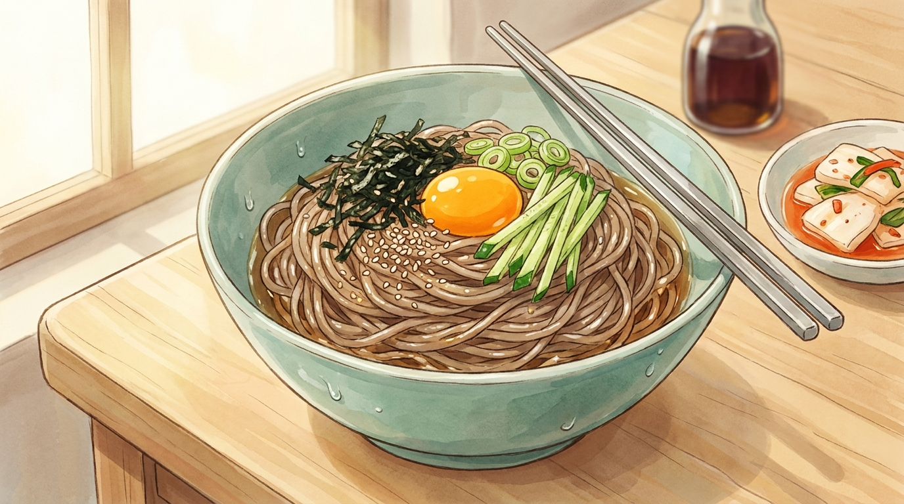

# 15분 들기름 막국수

불 앞에 오래 서 있기 싫은 날. 면만 삶으면 끝나는, 고소하고 짭조름한 한 그릇입니다.

- **분량**: 2인분
- **조리 시간**: 15분
- **난이도**: 아주 쉬움

## 재료

### 면
- 메밀 소바면 또는 막국수면 200g
- 얼음물 (헹굼용)

### 양념
- 들기름 3큰술
- 진간장 2큰술
- 맛술 1큰술
- 설탕 또는 올리고당 1작은술
- 다진 마늘 1/2작은술 (선택)

### 고명
- 김가루 한 줌 (또는 조미김 4장 부수기)
- 통깨 1큰술
- 쪽파 2대 (송송 썰기)
- 달걀 노른자 2개 (선택)
- 오이 1/3개 (채 썰기, 선택)

## 만드는 법

1. **물 올리기 (0분)** — 냄비에 물을 넉넉히 올리고 센 불로 끓입니다. 끓는 동안 볼에 얼음과 찬물을 담아 준비합니다.

2. **양념장 만들기 (3분)** — 큰 볼에 들기름, 진간장, 맛술, 설탕, 다진 마늘을 넣고 설탕이 녹을 때까지 젓습니다. **면을 여기에 바로 버무릴 거라 볼은 넉넉한 크기로 고르세요.**

3. **고명 준비 (5분)** — 쪽파를 송송 썰고 오이를 채 썹니다. 김은 손으로 부숴 둡니다.

4. **면 삶기 (9분)** — 물이 끓으면 면을 넣고 포장지 표시 시간대로 삶습니다. 넘치려 하면 찬물을 반 컵씩 부어 가라앉힙니다.

5. **찬물에 헹구기 (12분)** — 면을 체에 쏟고 흐르는 찬물에 손으로 비벼 가며 헹굽니다. **표면 전분이 완전히 빠질 때까지 30초 이상** 헹궈야 면이 쫄깃해집니다. 마지막에 얼음물에 10초 담갔다 건져 물기를 꽉 짭니다.

6. **버무리기 (14분)** — 물기 뺀 면을 양념 볼에 넣고 젓가락으로 들어 올리듯 30초간 버무립니다. 면 한 가닥까지 들기름이 코팅되어 윤이 나야 합니다.

7. **담기 (15분)** — 그릇에 담고 김가루, 통깨, 쪽파, 오이를 올립니다. 가운데를 살짝 파고 노른자를 얹으면 완성입니다.

## 성공 포인트

| 포인트 | 이유 |
|---|---|
| 물기를 꽉 짜세요 | 물이 남으면 양념이 묽어져 맛이 확 떨어집니다. |
| 들기름은 개봉한 지 얼마 안 된 것 | 들기름은 산패가 빨라 오래된 것은 쓴맛이 납니다. 냉장 보관하세요. |
| 양념에 면을 넣기 | 면 위에 양념을 붓지 말고 반대로 하세요. 훨씬 고르게 묻습니다. |
| 김은 마지막에 | 미리 넣으면 눅눅해져 식감이 사라집니다. |

## 응용

- **매콤하게**: 고춧가루 1작은술 또는 고추장 1/2큰술 추가
- **새콤하게**: 식초 1큰술 + 연겨자 조금
- **든든하게**: 수란이나 반숙 달걀, 편육 몇 점 추가
- **비건**: 노른자 대신 두부 으깬 것이나 아보카도

## 곁들이면 좋은 것

동치미 국물 한 컵이나 열무김치. 차가운 국물을 중간중간 마시면 들기름의 고소함이 계속 새롭게 느껴집니다.
