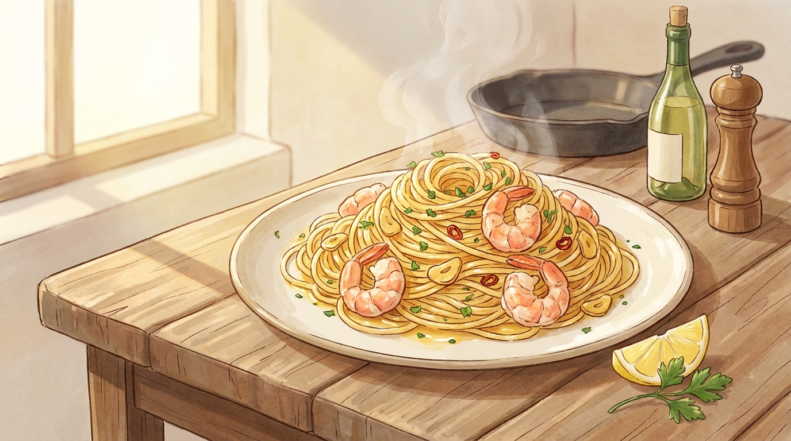

# 15분 마늘버터 새우 파스타

바쁜 평일 저녁에 딱 맞는 한 접시. 물 끓이는 시간까지 포함해서 15분이면 완성됩니다.

- **분량**: 2인분
- **조리 시간**: 15분
- **난이도**: 쉬움

## 재료

### 파스타
- 스파게티 200g
- 소금 1큰술 (면 삶는 물용)

### 소스
- 냉동 생새우 250g (해동 후 물기 제거)
- 버터 3큰술
- 올리브유 1큰술
- 마늘 6쪽 (얇게 편 썰기)
- 페페론치노 또는 건고추 2~3개 (선택)
- 화이트와인 또는 청주 3큰술
- 레몬즙 1큰술
- 소금, 후추 약간
- 파슬리 또는 쪽파 한 줌 (다지기)
- 파마산 치즈 (선택)

## 만드는 법

1. **물 올리기 (0분)** — 큰 냄비에 물을 넉넉히 붓고 센 불에 올립니다. 끓는 동안 마늘을 편 썰고 새우 물기를 키친타월로 닦아 둡니다. 물기를 제대로 제거해야 새우가 물러지지 않습니다.

2. **면 삶기 (4분)** — 물이 끓으면 소금 1큰술을 넣고 스파게티를 넣습니다. 포장지 표시 시간보다 1분 짧게 삶습니다. **면수 한 국자(약 200ml)는 반드시 따로 덜어 두세요.**

3. **마늘 향내기 (6분)** — 면이 삶아지는 동안 넓은 팬에 올리브유와 버터 1큰술을 넣고 중약 불로 녹입니다. 마늘과 페페론치노를 넣고 마늘이 연한 황금색이 될 때까지 2분간 천천히 볶습니다. 타면 쓴맛이 나니 불을 낮게 유지하세요.

4. **새우 굽기 (9분)** — 불을 중강으로 올리고 새우를 한 겹으로 펼쳐 넣습니다. 한 면당 1분 30초씩, 겉이 분홍색으로 변하고 살짝 C자로 말릴 때까지만 익힙니다. 소금과 후추로 간합니다.

5. **소스 만들기 (12분)** — 화이트와인을 붓고 30초간 알코올을 날립니다. 남은 버터 2큰술과 면수 반 국자를 넣고 팬을 흔들어 유화시킵니다. 소스가 살짝 걸쭉해집니다.

6. **버무리기 (14분)** — 삶은 면을 건져 팬에 바로 넣고 1분간 센 불에서 버무립니다. 소스가 뻑뻑하면 면수를 조금씩 추가합니다. 불을 끄고 레몬즙과 파슬리를 넣어 마무리합니다.

7. **담기 (15분)** — 접시에 집게로 돌돌 말아 담고, 취향에 따라 파마산 치즈와 후추를 뿌립니다.

## 성공 포인트

| 포인트 | 이유 |
|---|---|
| 면수를 버리지 마세요 | 전분이 버터와 물을 이어 주는 유화제 역할을 합니다. 물만 넣으면 소스가 겉돕니다. |
| 새우는 덜 익힌 듯이 | 팬에서 꺼낸 뒤에도 잔열로 계속 익습니다. O자로 말리면 이미 과조리입니다. |
| 마늘은 중약 불에서 | 향은 기름에 천천히 우러날 때 가장 진합니다. |
| 레몬즙은 불 끄고 나서 | 가열하면 산미가 날아가고 쓴맛만 남습니다. |

## 응용

- **매콤하게**: 페페론치노를 늘리거나 고춧가루 1작은술 추가
- **크리미하게**: 마지막에 생크림 3큰술 추가
- **채소 추가**: 방울토마토 한 줌을 4번 단계에서 함께 볶기
- **새우 대신**: 관자, 오징어, 베이컨 모두 잘 어울립니다

## 곁들이면 좋은 것

바게트 몇 조각과 루꼴라 샐러드(올리브유 + 레몬즙 + 소금). 화이트 와인이 있다면 소스에 쓰고 남은 것을 그대로 곁들이세요.
