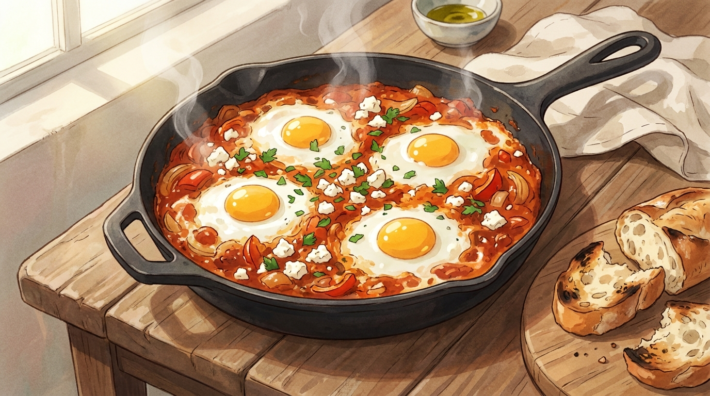

# 15분 에그인헬

팬 하나로 끝나는 토마토 달걀 스튜. 빵만 있으면 아침, 점심, 저녁 아무 때나 통합니다.

- **분량**: 2인분
- **조리 시간**: 15분
- **난이도**: 쉬움

## 재료

### 베이스
- 홀토마토 캔 400g (또는 토마토 파스타 소스 1컵)
- 양파 1/2개 (굵게 다지기)
- 파프리카 1/2개 (한 입 크기로 썰기)
- 마늘 4쪽 (다지기)
- 올리브유 2큰술

### 향신료
- 파프리카 가루 1작은술
- 커민 가루 1/2작은술 (있으면 꼭)
- 고춧가루 또는 칠리플레이크 1/2작은술
- 소금 1/2작은술, 후추 약간
- 설탕 1작은술 (토마토 산미 잡기용)

### 마무리
- 달걀 4개
- 페타 치즈 또는 모차렐라 한 줌 (선택)
- 파슬리 또는 고수 한 줌
- 바게트나 치아바타

## 만드는 법

1. **재료 손질 (0분)** — 양파, 파프리카, 마늘을 썹니다. 홀토마토는 캔째로 손이나 가위로 대충 으깨 둡니다.

2. **볶기 (3분)** — 깊은 팬에 올리브유를 두르고 중강 불에서 양파와 파프리카를 3분간 볶습니다. 양파 가장자리가 투명해지면 마늘을 넣고 30초 더 볶습니다.

3. **향신료 깨우기 (5분)** — 불을 중불로 낮추고 파프리카 가루, 커민, 고춧가루를 넣어 **30초만** 볶습니다. 기름에 향이 확 올라옵니다. 이 단계를 건너뛰면 가루 맛이 남습니다.

4. **소스 끓이기 (6분)** — 으깬 토마토, 소금, 후추, 설탕을 넣고 저은 뒤 중불에서 5분간 보글보글 끓입니다. 소스가 걸쭉해지고 표면에 기름이 살짝 뜨면 됩니다.

5. **달걀 넣기 (11분)** — 숟가락으로 소스에 홈을 4개 파고 달걀을 하나씩 깨 넣습니다. 흰자 부분에만 소금을 살짝 뿌립니다.

6. **뚜껑 덮고 익히기 (12분)** — 뚜껑을 덮고 약불에서 3~4분. **흰자는 완전히 굳고 노른자는 흔들릴 때** 불을 끕니다. 뚜껑 없이 익히면 흰자가 익기 전에 바닥이 탑니다.

7. **마무리 (15분)** — 치즈를 부수어 뿌리고 파슬리를 흩뿌립니다. 팬째로 식탁에 올려 빵으로 퍼먹습니다.

## 성공 포인트

| 포인트 | 이유 |
|---|---|
| 향신료는 기름에 먼저 | 지용성 향 성분은 기름에서만 제대로 우러납니다. |
| 소스를 충분히 졸이기 | 묽으면 달걀이 가라앉아 삶은 달걀처럼 됩니다. |
| 설탕 1작은술 | 캔 토마토 특유의 금속성 신맛을 눌러 줍니다. |
| 잔열 계산 | 불을 끈 뒤에도 1분간 계속 익습니다. 살짝 덜 익었을 때 끄세요. |

## 응용

- **든든하게**: 초리조나 베이컨을 2번 단계에서 함께 볶기
- **크리미하게**: 4번 끝에 생크림 2큰술 또는 요거트 한 숟갈
- **초록 버전**: 토마토 대신 시금치 + 크림으로 그린 샥슈카
- **매운맛**: 하리사 1큰술 또는 청양고추 1개

## 곁들이면 좋은 것

노릇하게 구운 바게트, 그리고 올리브유와 소금만 뿌린 루꼴라. 남은 소스는 빵으로 팬을 닦아 먹는 게 정석입니다.
