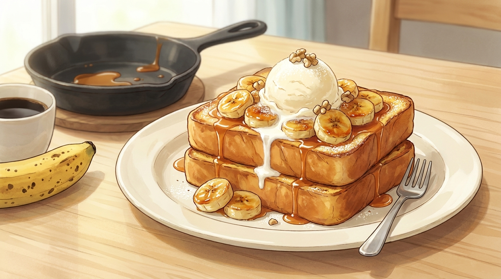

# 15분 캐러멜 바나나 프렌치토스트

식빵 두 장과 무르익은 바나나 하나면 됩니다. 겉은 캐러멜처럼 바삭하고 속은 푸딩처럼 촉촉한 디저트.

- **분량**: 2인분
- **조리 시간**: 15분
- **난이도**: 쉬움

## 재료

### 토스트
- 두꺼운 식빵 4장 (2cm 두께, 하루 지난 것이 좋음)
- 달걀 2개
- 우유 120ml
- 설탕 1큰술
- 바닐라 익스트랙 1/2작은술 (선택)
- 소금 한 꼬집
- 계피 가루 약간 (선택)
- 버터 2큰술 (굽기용)

### 캐러멜 바나나
- 바나나 2개 (껍질에 갈색 점이 핀 것)
- 버터 2큰술
- 흑설탕 3큰술
- 생크림 2큰술 (또는 우유)
- 소금 한 꼬집

### 마무리
- 바닐라 아이스크림 2스쿱
- 슈거파우더, 다진 호두나 피칸 (선택)

## 만드는 법

1. **달걀물 만들기 (0분)** — 넓적한 그릇에 달걀, 우유, 설탕, 바닐라, 소금, 계피를 넣고 **거품기로 30초 이상** 완전히 풀어 줍니다. 흰자 덩어리가 남으면 구웠을 때 하얀 얼룩이 생깁니다.

2. **빵 적시기 (2분)** — 식빵을 달걀물에 담가 **한 면당 30초씩**만 적십니다. 두꺼운 빵은 40초까지. 너무 오래 담그면 가운데가 질척해져 부칠 때 무너집니다.

3. **바나나 자르기 (4분)** — 바나나를 1.5cm 두께로 어슷 썹니다. 미리 썰어 두면 갈변하니 굽기 직전에 하세요.

4. **토스트 굽기 (5분)** — 팬을 **중약 불**로 달구고 버터 1큰술을 녹입니다. 빵을 올려 한 면당 2분 30초씩, 진한 황금색이 될 때까지 굽습니다. 두 번에 나눠 구우면서 버터를 매번 새로 넣습니다. 불이 세면 겉만 타고 속은 안 익습니다.

5. **캐러멜 만들기 (11분)** — 토스트를 접시에 옮기고 같은 팬에 버터 2큰술과 흑설탕을 넣습니다. 중불에서 저으면 1분 안에 부글부글 끓으며 캐러멜이 됩니다.

6. **바나나 굽기 (12분)** — 바나나를 넣고 한 면당 45초씩, 가장자리가 갈색으로 눌을 때까지 굽습니다. 생크림과 소금을 넣고 15초 저으면 소스가 매끈해집니다. **바나나는 뒤적이지 말고 뒤집기만** 하세요. 으깨집니다.

7. **담기 (15분)** — 접시에 토스트를 겹쳐 담고 캐러멜 바나나를 소스째 끼얹습니다. 아이스크림을 얹고 슈거파우더와 견과류를 뿌립니다. 아이스크림이 녹기 시작할 때가 가장 맛있습니다.

## 성공 포인트

| 포인트 | 이유 |
|---|---|
| 하루 지난 빵 | 수분이 빠져 달걀물을 더 잘 머금고 형태도 안 무너집니다. |
| 중약 불로 천천히 | 달걀물이 속까지 익을 시간이 필요합니다. 센 불은 겉만 태웁니다. |
| 소금 한 꼬집 | 캐러멜의 단맛을 눌러 주는 게 아니라 오히려 또렷하게 만듭니다. |
| 팬을 씻지 않기 | 토스트를 구운 버터 향이 캐러멜에 그대로 녹아듭니다. |

## 응용

- **어른 버전**: 캐러멜에 럼이나 브랜디 1큰술 (생크림 넣기 직전에)
- **딸기 버전**: 바나나 대신 딸기 + 발사믹 1작은술
- **비건**: 달걀물 대신 두유 + 옥수수전분 1큰술, 버터 대신 코코넛 오일
- **간단하게**: 아이스크림 대신 그릭요거트 한 숟갈

## 곁들이면 좋은 것

블랙커피나 아메리카노. 단맛이 강한 디저트라 설탕 없는 진한 커피가 균형을 잡아 줍니다. 홍차라면 아쌈이나 얼그레이.
