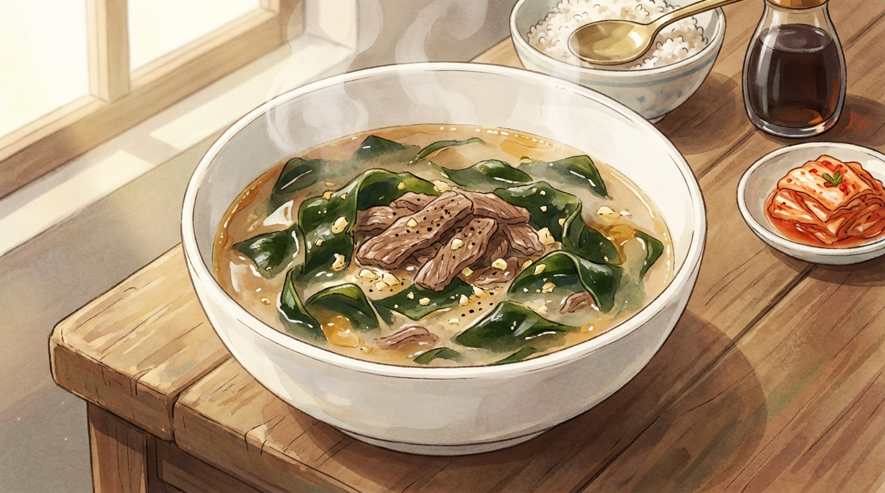

# 15분 소고기 미역국

생일이 아니어도, 속이 허할 때 끓이는 국. 오래 고아 낸 미역국과 같지는 않지만, 참기름에 볶는 과정만 지키면 15분에도 국물이 뽀얗게 나옵니다.

- **분량**: 2인분
- **조리 시간**: 15분
- **난이도**: 쉬움

## 재료

### 국물
- 자른 건미역 10g (마른 상태로 한 줌, 종이컵 1/2컵)
- 소고기 국거리 150g (양지 또는 아롱사태)
- 뜨거운 물 1L (전기포트로 미리 끓이기)

### 볶음 양념
- 참기름 1.5큰술
- 다진 마늘 1큰술
- 국간장 1큰술
- 후추 약간

### 마무리
- 소금 1/2작은술 (간 보며 조절)
- 국간장 1작은술 (색 보정용, 선택)

## 만드는 법

1. **미역 불리기 (0분)** — 자른 미역을 볼에 담고 미지근한 물을 넉넉히 부어 둡니다. **마른 미역은 8~10배로 불어납니다** — 2인분에 한 줌 이상 넣으면 국이 아니라 미역 무침이 됩니다. 동시에 전기포트에 물 1L를 올립니다.

2. **고기 손질 (2분)** — 소고기는 키친타월로 눌러 핏물을 닦습니다. 씻지 말고 닦기만 하세요. 물에 씻으면 감칠맛까지 빠집니다.

3. **고기 볶기 (4분)** — 냄비에 참기름 1.5큰술을 두르고 소고기와 다진 마늘을 넣어 중강불에서 2분간 볶습니다. 겉면이 하얗게 익고 마늘 향이 올라오면 됩니다.

4. **국간장 코팅 (6분)** — 국간장 1큰술을 고기 위에 직접 둘러 30초 더 볶습니다. **국물에 풀지 말고 뜨거운 냄비 바닥에서 한 번 졸여야** 간장의 날내가 날아가고 구수한 향이 남습니다.

5. **미역 볶기 (7분)** — 불린 미역을 손으로 꽉 짜서 물기를 뺀 뒤 냄비에 넣고 2분간 볶습니다. 미역이 진한 초록색으로 바뀌고 기름을 머금으면 됩니다. 이 단계가 15분 미역국의 전부입니다.

6. **물 붓고 끓이기 (9분)** — 끓여 둔 뜨거운 물 1L를 붓고 센 불로 올립니다. 찬물을 부으면 끓어오르는 데만 7분이 더 듭니다. 끓기 시작하면 위에 뜨는 회색 거품을 걷어 냅니다.

7. **중불에서 우리기 (11분)** — 뚜껑을 반쯤 덮고 중불에서 3분간 끓입니다. 국물이 맑은 갈색에서 살짝 뽀얗게 바뀝니다.

8. **간 맞추기 (14분)** — 소금 1/2작은술을 넣고 맛을 봅니다. 싱거우면 소금을 더하고, 색이 옅으면 국간장을 1작은술만 추가합니다. 후추를 살짝 뿌립니다.

9. **담기 (15분)** — 대접에 미역과 고기가 고루 담기도록 국자로 바닥부터 떠서 붓습니다. 참기름은 이미 들어갔으니 더 두르지 않습니다.

## 성공 포인트

| 포인트 | 이유 |
|---|---|
| 미역은 마른 상태로 한 줌만 | 건미역은 물을 먹으면 8~10배로 부풀어요. 눈대중으로 넉넉히 넣었다가 냄비가 넘치고 국물이 사라지는 게 이 요리의 1번 실패입니다. |
| 미역을 반드시 참기름에 볶기 | 미역 표면의 점질 성분이 기름에 코팅되면서 국물에 유화됩니다. 뽀얀 국물과 고소한 향이 여기서 나와요. 물부터 붓고 끓이면 30분을 끓여도 국물이 밍밍하고 비립니다. |
| 국간장은 고기에 직접 둘러 볶기 | 간장은 뜨거운 팬에 닿을 때 아미노산과 당이 반응해 향이 생깁니다. 국물에 그냥 풀면 짠맛만 남습니다. |
| 색은 국간장, 간은 소금 | 국간장으로만 간을 맞추려면 3큰술 이상 들어가고, 국물이 탁한 갈색이 됩니다. 색이 잡히면 나머지는 소금으로. |
| 뜨거운 물로 시작 | 15분 안에 끝내는 유일한 방법입니다. 찬물 1L를 끓이는 데만 7분 이상 걸립니다. |

## 응용

- **얼큰하게**: 고춧가루 1큰술을 4번 단계에서 참기름과 함께 볶고, 마무리에 청양고추 1개를 어슷 썰어 넣습니다.
- **들깨 미역국**: 마지막 2분에 들깨가루 3큰술을 풀면 국물이 걸쭉하고 고소해집니다. 들깨는 오래 끓이면 텁텁해지니 마지막에.
- **해물로 바꾸기**: 소고기 대신 해감한 바지락 200g. 고기 볶는 단계를 건너뛰고 미역만 볶은 뒤, 물을 붓고 끓기 시작할 때 조개를 넣습니다.
- **비건 버전**: 고기를 빼고 마른 표고 2개와 다시마 1장을 뜨거운 물에 함께 우립니다. 국간장 대신 조선간장, 마지막에 두부 1/2모를 깍둑 썰어 넣으면 단백질까지 채워집니다.

## 곁들이면 좋은 것

갓 지은 흰밥과 잘 익은 배추김치. 미역국은 간이 순해서 짭조름한 반찬 하나가 있어야 밥이 넘어갑니다. 여유가 있다면 달걀말이를 곁들이면 한 상이 됩니다.
