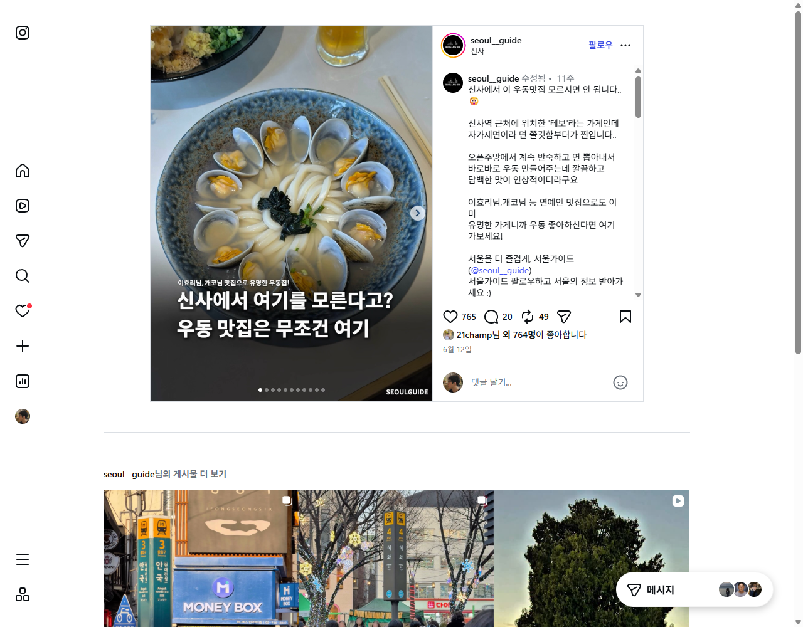
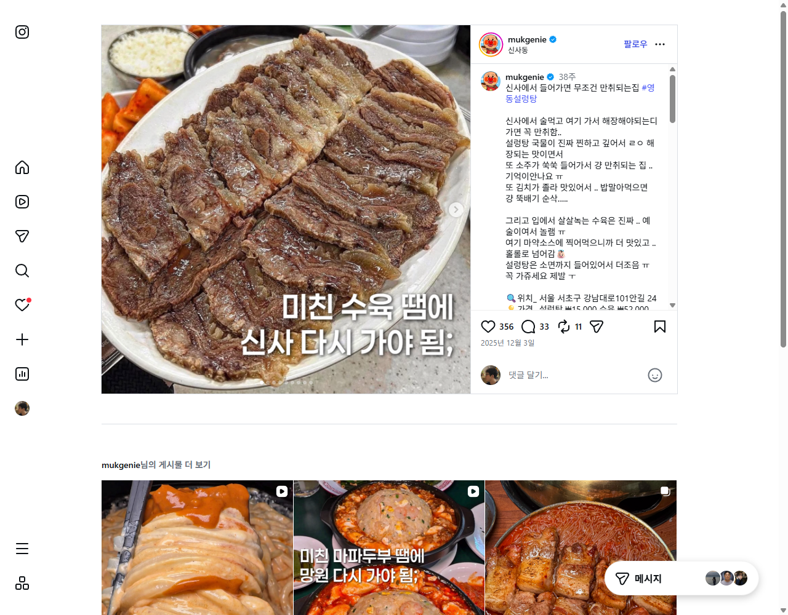
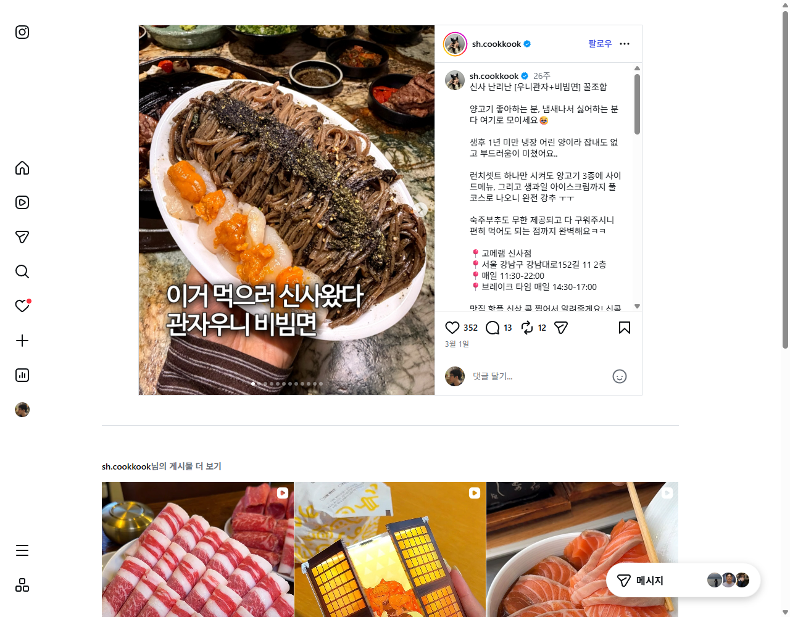

# 인스타그램 #신사맛집 — 베스트 지점 3선

> 조사일: 2026-09-01
> 출처: Instagram 해시태그 [#신사맛집](https://www.instagram.com/explore/search/keyword/?q=%23%EC%8B%A0%EC%82%AC%EB%A7%9B%EC%A7%91) (로그인 계정 @ruucm)
> 방법: Playwright MCP로 `#신사맛집` 검색 → 단일 가게를 소개하는 게시물 13건을 개별 방문해 좋아요·댓글·공유 수와 작성 계정 팔로워를 수집

## 픽 기준

1. **가게 공식계정 게시물은 제외** — 홍보 글이라 반응 수를 다른 후보와 같은 잣대로 볼 수 없음 (동녘·주토피아·멘쇼쿠가 여기 해당)
2. 남은 **제3자 리뷰/큐레이션 계정** 게시물을 좋아요 수 기준으로 정렬
3. 캡션에 **주소·가격·영업시간**이 적혀 있어 바로 갈 수 있는 곳 우대

---

## 픽 3개

### 🥇 1위 · 테보 (신사 우동) — 좋아요 **765**

| 항목 | 내용 |
|---|---|
| 업종 | 자가제면 우동 |
| 위치 | 신사역 인근 · [@tebo.seoul](https://www.instagram.com/tebo.seoul/) |
| 영업시간 | 11:30–20:30 |
| 가격 | 카케우동+모시조개 13,000원 · 붓카케우동+텐푸라 14,000원 |
| 게시물 반응 | 좋아요 765 · 댓글 20 · **공유 49 (후보 중 최다)** |
| 작성 계정 | [서울가이드 @seoul__guide](https://www.instagram.com/seoul__guide/) · 팔로워 22.1만 |
| 게시일 | 2026-06-12 |
| 링크 | [게시물 보기](https://www.instagram.com/p/DZe0bFck6JX/) |

오픈주방에서 반죽·제면을 바로 하는 자가제면 우동집. 이효리·개코 등 연예인 맛집으로도 언급됨. 좋아요 수뿐 아니라 **공유 49건**으로 "저장해두고 실제로 가려는" 반응이 가장 강했음.

---

### 🥈 2위 · 영동설렁탕 — 좋아요 **356**

| 항목 | 내용 |
|---|---|
| 업종 | 설렁탕·수육 (해장/술안주) |
| 주소 | 서울 서초구 강남대로101안길 24 |
| 영업시간 | **24시간 · 연중무휴** |
| 가격 | 설렁탕 15,000원 · 수육 52,000원 |
| 게시물 반응 | 좋아요 356 · **댓글 33 (후보 중 최다)** · 공유 11 |
| 작성 계정 | [먹지니 @mukgenie](https://www.instagram.com/mukgenie/) · 팔로워 22.9만 |
| 게시일 | 2025-12-03 |
| 링크 | [게시물 보기](https://www.instagram.com/p/DRzKKVViVZJ/) |

국물이 진한 설렁탕과 수육. 24시간 영업이라 신사에서 술 마신 뒤 해장 코스로 픽하기 좋음. 3개 픽 중 유일하게 **시간 제약이 없는 곳**.

---

### 🥉 3위 · 고메램 신사점 — 좋아요 **352**

| 항목 | 내용 |
|---|---|
| 업종 | 양고기 (생후 1년 미만 냉장 어린 양) |
| 주소 | 서울 강남구 강남대로152길 11 2층 |
| 영업시간 | 매일 11:30–22:00 (브레이크 14:30–17:00) |
| 가격 | 런치세트 — 양고기 3종 + 사이드 + 생과일 아이스크림 (금액 미표기) |
| 게시물 반응 | 좋아요 352 · 댓글 13 · 공유 12 |
| 작성 계정 | [신콕 @sh.cookkook](https://www.instagram.com/sh.cookkook/) · **팔로워 24만 (후보 중 최다)** |
| 게시일 | 2026-03-01 |
| 링크 | [게시물 보기](https://www.instagram.com/p/DVVPCUgjxFe/) |

잡내 없는 어린 양 + 직원이 다 구워주는 방식. 런치세트 하나로 풀코스가 나와 점심 가성비 픽. 다만 **캡션에 가격이 없어 방문 전 확인 필요**.

---

## 전체 후보 비교표

| 가게 | 업종 | 좋아요 | 댓글 | 공유 | 작성 계정 (팔로워) | 게시일 | 판정 |
|---|---|---:|---:|---:|---|---|---|
| **테보** | 우동 | **765** | 20 | 49 | 서울가이드 (22.1만) | 2026-06-12 | ✅ **1위** |
| **영동설렁탕** | 설렁탕 | **356** | 33 | 11 | 먹지니 (22.9만) | 2025-12-03 | ✅ **2위** |
| **고메램 신사점** | 양고기 | **352** | 13 | 12 | 신콕 (24만) | 2026-03-01 | ✅ **3위** |
| 봉금 | 한식주점 | 201 | 16 | 10 | 뚜언니 (7.1만) | 2026-07-18 | 4위 |
| 대봉칼국수보쌈 | 보쌈·칼국수 | 120 | 4 | 1 | 투고리스트 (6.4만) | 2026-03-29 | 반응 약함 |
| 핫쵸 가로수길 | 오코노미야끼 | 69 | 20 | 4 | 디온집 (5.4천) | 2026-03-04 | 계정 규모 작음 (참여율은 1.3%로 높음) |
| 꿉당 | 목살 (미쉐린 2025) | 55 | 31 | 1 | onl_mohaji (1.2천) | 2025-11-04 | 미쉐린 선정이나 게시물 반응 낮음 |
| 날리 | 다이닝바 | 52 | 8 | 2 | 디깅서울 (1만) | 2026-06-03 | 반응 약함 |
| 프렌치쪽갈비 | 쪽갈비 | 비공개 | 0 | — | idoeats (6천) | 2026-07-25 | 좋아요 비공개 · 자체 평점 7.8/10 |
| 동녘 | 야장 한식주점 | 1,147 | 18 | 71 | **동녘 공식계정** (881) | 2026-04-25 | ❌ 업체 자체 홍보 → 제외 |
| 주토피아 | 나폴리 피자 | 305 | 30 | 6 | **주토피아 공식계정** (2.7천) | 2026-06-07 | ❌ 업체 자체 홍보 → 제외 |
| 멘쇼쿠 | 라멘 (흑백요리사) | 비공개 | 3 | — | **멘쇼쿠 공식계정** (3.5천) | 2026-07-21 | ❌ 업체 자체 홍보 → 제외 |

---

## ⚠️ 참고사항

- 좋아요·댓글·공유 수는 **2026-09-01 기준** 값이며 계속 변합니다.
- 인스타그램 맛집 게시물은 **협찬·광고가 표시되지 않는 경우가 많습니다.** 세 픽 모두 캡션에 유료광고 표기는 없었으나, 실제 협찬 여부는 확인 불가.
- 반응 수가 큰 계정일수록 절대 좋아요 수가 유리합니다. **참여율(좋아요/팔로워)** 기준으로 보면 디온집의 핫쵸 게시물(1.3%)이 1위(0.35%)보다 높습니다.
- 가격·영업시간은 게시물 작성 시점 기준이라 방문 전 네이버플레이스·캐치테이블에서 재확인을 권합니다.
- 제외한 3곳(동녘·주토피아·멘쇼쿠)은 홍보 게시물이라 순위에서 뺐을 뿐, **가게 자체의 평가가 낮다는 뜻은 아닙니다.** 특히 멘쇼쿠는 흑백요리사 출연 이력이 있습니다.
